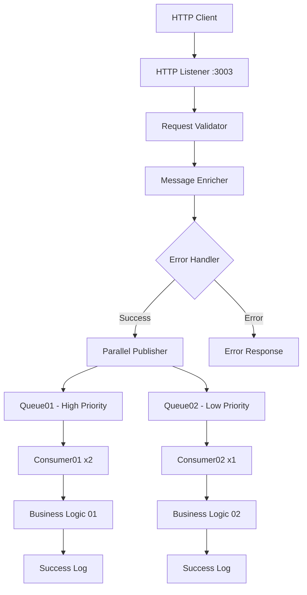
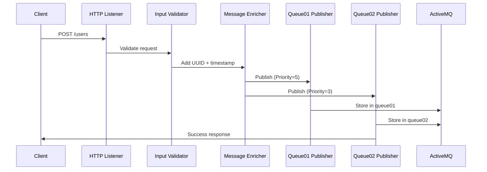
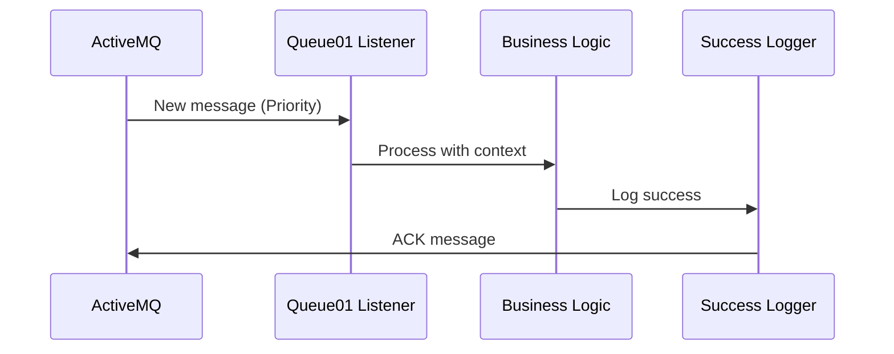
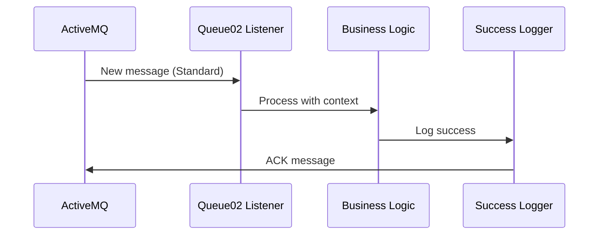

# 🚀 QueueMaster - Enterprise Messaging Solution

<div align="center">
  
  
  
  
  
</div>

---

## 🎯 **Sobre o QueueMaster**

**QueueMaster** é uma solução empresarial de mensageria assíncrona construída com **MuleSoft Mule 4** e **Apache ActiveMQ**. Projetado para alta performance, escalabilidade e resiliência, implementa padrões avançados de integração com foco em **observabilidade** e **error handling robusto**.

### 💡 **Principais Diferenciais:**
- ✅ **Error Handling Avançado** - Try-catch em todos os fluxos críticos
- ✅ **Message Tracking** - UUID único para rastreabilidade completa
- ✅ **Priority Queues** - Processamento com diferentes prioridades
- ✅ **Multiple Consumers** - Escalabilidade automática
- ✅ **Structured Logging** - Logs formatados para análise
- ✅ **HTTP Responses** - Confirmação instantânea para clientes

## 🏗️ **Arquitetura Enterprise**



### 🔧 **Componentes Técnicos:**

| Componente | Função | Configuração |
|------------|--------|--------------|
| **HTTP Producer** | Recebe requests REST | `0.0.0.0:3003/users` |
| **Message Enricher** | Adiciona UUID, timestamp | `DataWeave 2.0` |
| **Queue01 Publisher** | Alta prioridade (Priority=5) | `2 consumers` |
| **Queue02 Publisher** | Baixa prioridade (Priority=3) | `1 consumer` |
| **Error Handler** | Try-catch + logging | `Global scope` |
| **ActiveMQ Broker** | Message persistence | `tcp://0.0.0.0:61616` |

### 🎯 **Padrões Implementados:**
- **Producer-Consumer Pattern**
- **Error Handling Pattern**
- **Message Correlation Pattern**
- **Priority Queue Pattern**
- **Dead Letter Queue** (configurável)

## �️ **Stack Tecnológico**

### **Core Technologies**
| Tecnologia | Versão | Propósito |
|------------|--------|-----------|
| **MuleSoft Mule Runtime** | `4.9.0` | Integration Platform |
| **Apache ActiveMQ** | `5.15.16` | Message Broker |
| **Java SDK** | `17 LTS` | Runtime Environment |
| **Apache Maven** | `4.3.0` | Build & Dependency Management |

### **Mule Connectors**
- 🌐 **HTTP Connector** `1.10.3` - REST API endpoints
- 📨 **JMS Connector** `1.9.7` - Message Queue integration
- 🔌 **Sockets Connector** `1.2.5` - TCP/UDP communication
- ⚡ **DataWeave** `2.0` - Data transformation

### **DevOps & Monitoring**
- 📊 **Log4j2** - Structured logging
- 🔍 **ActiveMQ Web Console** - Real-time monitoring
- 🐳 **Docker Support** - Containerization ready
- ☁️ **CloudHub Compatible** - Cloud deployment

## 📁 **Estrutura Detalhada do Projeto**

```
📦 QueueMaster/
├── 🗂️ src/main/
│   ├── 🔧 mule/
│   │   ├── 📄 active-mq.xml                    # 🚀 Fluxos principais (3 flows)
│   │   └── ⚙️ config/
│   │       └── 📄 global-connections.xml       # 🔗 Configs JMS + HTTP
│   └── 📚 resources/
│       ├── 📄 application-types.xml            # 📋 Data types definition
│       ├── 📄 log4j2.xml                      # 📝 Logging configuration
│       └── 🔒 api/ (future API specs)
├── 🧪 src/test/
│   ├── ☕ java/ (unit tests)
│   ├── 🔬 munit/ (integration tests)
│   └── 📚 resources/
│       └── 📄 log4j2-test.xml                 # 🧪 Test logging config
├── 📋 pom.xml                                  # 🏗️ Maven dependencies
├── ⚙️ mule-artifact.json                       # 🎯 Runtime config
├── 📖 README.md                               # 📚 Documentation
└── 🎯 target/ (build artifacts)
```

## ⚙️ Configuração

### Pré-requisitos

1. **Java 17** ou superior
2. **Maven 3.8** ou superior
3. **Anypoint Studio** 
4. **Apache ActiveMQ** rodando na porta `61616`

### Configuração do ActiveMQ

A aplicação está configurada para conectar ao ActiveMQ com as seguintes configurações:

```xml
<jms:active-mq-connection username="admin" password="admin">
    <jms:factory-configuration brokerUrl="tcp://0.0.0.0:61616" />
</jms:active-mq-connection>
```

### Configuração HTTP

O HTTP Listener está configurado para:
- **Host**: 0.0.0.0
- **Porta**: 3003
- **Endpoint**: `/users`

## � **Guia de Execução Rápida**

### **🐳 Opção 1: Docker (Recomendado)**

```bash
# 1. Subir ActiveMQ via Docker
docker run -d --name activemq \
  -p 61616:61616 -p 8161:8161 \
  apache/activemq-classic:5.15.16

# 2. Verificar se está rodando
docker logs activemq

# 3. Executar a aplicação
mvn clean compile mule:run
```

### **💻 Opção 2: Instalação Local**

```bash
# 1. Download e setup do ActiveMQ
wget https://archive.apache.org/dist/activemq/5.15.16/apache-activemq-5.15.16-bin.tar.gz
tar -xzf apache-activemq-5.15.16-bin.tar.gz
cd apache-activemq-5.15.16

# 2. Iniciar o broker (modo background)
./bin/activemq start

# 3. Verificar status
./bin/activemq status

# 4. Executar aplicação Mule
cd /path/to/queuemaster
mvn clean compile mule:run
```

### **🧪 Testes Completos**

```bash
# ✅ 1. Teste básico de conectividade
curl -X POST http://localhost:3003/users \
  -H "Content-Type: application/json" \
  -d '{"name": "João Silva", "email": "joao@email.com", "age": 30}'

# ✅ 2. Teste com payload complexo
curl -X POST http://localhost:3003/users \
  -H "Content-Type: application/json" \
  -d '{
    "name": "Maria Santos",
    "email": "maria@empresa.com",
    "address": {
      "street": "Rua das Flores, 123",
      "city": "São Paulo",
      "zipcode": "01234-567"
    },
    "preferences": ["email", "sms"]
  }'

# ✅ 3. Teste de erro (payload inválido)
curl -X POST http://localhost:3003/users \
  -H "Content-Type: text/plain" \
  -d 'invalid json data'
```

### **📊 Respostas Esperadas**

**✅ Sucesso (200):**
```json
{
  "status": "SUCCESS",
  "message": "Message published to both queues successfully",
  "messageId": "550e8400-e29b-41d4-a716-446655440000",
  "timestamp": "2026-01-21T15:30:45.123Z"
}
```

**❌ Erro (500):**
```json
{
  "status": "ERROR",
  "message": "Failed to publish message to queues",
  "error": "Connection refused to ActiveMQ broker",
  "timestamp": "2026-01-21T15:30:45.123Z"
}
```

## 📊 **Fluxos de Dados Avançados**

### 🔄 **Flow 1: HTTP Producer (http-producer-flow)**


**📋 Etapas Detalhadas:**
1. **Input Validation** - Valida Content-Type e estrutura JSON
2. **Request Logging** - Log estruturado com headers e payload
3. **Message Enrichment** - Adiciona `messageId`, `timestamp`, `source`
4. **Error Handling Scope** - Try-catch com rollback automático
5. **Parallel Publishing** - Publica simultaneamente em 2 filas
6. **Correlation ID** - Tracking end-to-end com UUID
7. **HTTP Response** - Confirmação imediata para o cliente

### 🔄 **Flow 2: Queue01 Consumer (queue01-consumer-flow)**


**⚙️ Configurações:**
- **Consumers**: `2 instances` (alta performance)
- **ACK Mode**: `AUTO` (confirmação automática)
- **Priority**: `5` (processamento prioritário)
- **Content-Type**: `application/json`

### 🔄 **Flow 3: Queue02 Consumer (queue02-consumer-flow)**


**⚙️ Configurações:**
- **Consumers**: `1 instance` (processamento padrão)
- **ACK Mode**: `AUTO` (confirmação automática)
- **Priority**: `3` (processamento secundário)
- **Content-Type**: `application/json`

## 📝 **Sistema de Logs Avançado**

### 🎯 **Structured Logging com Log4j2**

```xml
<!-- log4j2.xml configuration -->
<Configuration>
    <Appenders>
        <RollingFile name="FileAppender" fileName="logs/queuemaster.log">
            <PatternLayout>
                <Pattern>%d{yyyy-MM-dd HH:mm:ss.SSS} [%t] %-5level [%X{messageId}] %logger{36} - %msg%n</Pattern>
            </PatternLayout>
            <Policies>
                <SizeBasedTriggeringPolicy size="100MB"/>
            </Policies>
        </RollingFile>
    </Appenders>
</Configuration>
```

### 📊 **Categorias de Logs**

| Nível | Categoria | Exemplo | Uso |
|-------|-----------|---------|-----|
| `INFO` | **Request Processing** | `Processing Queue01 - MessageID: abc-123` | Fluxo normal |
| `ERROR` | **JMS Failures** | `JMS Publish failed: Connection refused` | Erros de conexão |
| `WARN` | **Business Logic** | `Invalid email format in payload` | Validações |
| `DEBUG` | **Performance** | `Queue01 processing took 150ms` | Otimização |
| `TRACE` | **Message Flow** | `Message correlation: req-123 → msg-456` | Debugging |

### 🔍 **Log Correlation**
```bash
# Buscar por messageId específico
grep "550e8400-e29b-41d4-a716-446655440000" logs/queuemaster.log

# Filtrar apenas erros JMS
grep "JMS.*ERROR" logs/queuemaster.log

# Monitorar em tempo real
tail -f logs/queuemaster.log | grep "Processing Queue"
```

## 🔍 **Monitoramento & Observabilidade**

### 🎛️ **ActiveMQ Management Console**
| Recurso | URL | Credenciais | Funcionalidade |
|---------|-----|-------------|---------------|
| **Web Console** | `http://localhost:8161/admin` | `admin/admin` | Monitoring em tempo real |
| **REST API** | `http://localhost:8161/api` | `admin/admin` | Métricas programáticas |
| **Jolokia JMX** | `http://localhost:8161/jolokia` | `admin/admin` | JMX via HTTP |

### 📊 **Métricas Principais**

**🏃‍♂️ Performance Metrics:**
```bash
# Throughput das filas
curl -u admin:admin http://localhost:8161/api/jolokia/read/org.apache.activemq:type=Broker,brokerName=localhost,destinationType=Queue,destinationName=*/EnqueueCount

# Latência média
curl -u admin:admin http://localhost:8161/api/jolokia/read/org.apache.activemq:type=Broker,brokerName=localhost,destinationType=Queue,destinationName=*/AverageMessageSize
```

**📈 Queue Health Dashboard:**
| Métrica | Queue01 (High Priority) | Queue02 (Low Priority) | Alerta |
|---------|------------------------|------------------------|--------|
| **Messages Enqueued** | `>1000/min` | `>500/min` | 🟢 Normal |
| **Messages Dequeued** | `>950/min` | `>450/min` | 🟡 Slow |
| **Queue Size** | `<100` | `<200` | 🔴 Backlog |
| **Consumer Count** | `2 active` | `1 active` | 🔴 Offline |

### 🚨 **Alertas Configurados**

```bash
# Health check script
#!/bin/bash
QUEUE_SIZE=$(curl -s -u admin:admin \
  "http://localhost:8161/api/jolokia/read/org.apache.activemq:type=Broker,brokerName=localhost,destinationType=Queue,destinationName=queue01/QueueSize" \
  | jq '.value')

if [ "$QUEUE_SIZE" -gt 100 ]; then
  echo "🚨 ALERT: Queue01 backlog detected - Size: $QUEUE_SIZE"
fi
```

### 📱 **Dashboards Recomendados**
- **Grafana + Prometheus** - Métricas em tempo real
- **ELK Stack** - Logs centralizados
- **Datadog/New Relic** - APM enterprise
- **MuleSoft Anypoint Monitoring** - Native monitoring

## 🚦 Status da Aplicação

Para verificar se a aplicação está funcionando:

1. **Health Check**: `GET http://localhost:3003/users`
2. **ActiveMQ Console**: Verificar filas em http://localhost:8161/admin
3. **Logs da Aplicação**: Verificar saída do console

## 🔧 **Desenvolvimento Avançado**

### 🚀 **Comandos de Build**

```bash
# 🧹 Clean + Compile
mvn clean compile

# 🔧 Build completo
mvn clean package

# 🧪 Testes unitários
mvn test

# 🔍 Testes de integração
mvn verify

# 🚀 Deploy local
mvn clean package mule:deploy

# 🐛 Debug mode
mvn mule:run -Dmule.debug.enable=true -Dmule.debug.port=5005
```

### 🛠️ **Configuração do Anypoint Studio**

1. **Import Project:**
   ```
   File → Import → Anypoint Studio → Anypoint Studio Project from File System
   ```

2. **Run Configuration:**
   ```
   Run → Run Configurations → Mule Application → New
   Project: active-mq
   Environment: Development
   ```

3. **Debug Configuration:**
   ```
   Debug → Debug Configurations → Mule Application
   VM Args: -Dmule.debug.enable=true
   ```

### 🧪 **Testes Automatizados**

```xml
<!-- MUnit Test Example -->
<munit:test name="test-http-producer-flow" description="Test HTTP to JMS flow">
    <munit:execution>
        <http:request method="POST" config-ref="HTTP_Request_Config" path="/users">
            <http:body><![CDATA[{"name":"Test User"}]]></http:body>
        </http:request>
    </munit:execution>
    <munit:validation>
        <munit-tools:assert-that 
            expression="#[payload.status]" 
            is="#[MunitTools::equalTo('SUCCESS')]" />
    </munit:validation>
</munit:test>
```

### 🐛 **Troubleshooting Guide**

| Problema | Sintoma | Solução |
|----------|---------|----------|
| **JMS Connection Failed** | `Connection refused` | Verificar se ActiveMQ está rodando |
| **HTTP 404** | `Not Found` | Verificar porta 3003 e path `/users` |
| **OutOfMemory** | `Heap space` | Aumentar `-Xmx` para 2GB |
| **Queue Backlog** | Mensagens acumulando | Aumentar número de consumers |
| **Slow Performance** | Alta latência | Verificar network e DB connections |

### 🔐 **Configurações de Segurança**

```xml
<!-- Production Security Config -->
<jms:active-mq-connection 
    username="${activemq.username}" 
    password="${activemq.password}"
    trustedPackages="com.mycompany.queuemaster.*">
    <jms:factory-configuration 
        brokerUrl="ssl://activemq-prod.company.com:61617"
        trustStore="${ssl.truststore.path}"
        trustStorePassword="${ssl.truststore.password}" />
</jms:active-mq-connection>
```

### 📦 **Build para Produção**

```bash
# 1. Profile de produção
mvn clean package -Pproduction

# 2. Gerar artefato deployable
mvn clean package mule:package

# 3. Verificar artefato
ls -la target/*.jar

# 4. Deploy para CloudHub
mvn clean deploy -DmuleDeploy \
    -Dcloudhub.application.name=queuemaster-prod \
    -Dcloudhub.environment=Production
```

## 📚 Documentação Adicional

- [MuleSoft Documentation](https://docs.mulesoft.com/)
- [Apache ActiveMQ Documentation](https://activemq.apache.org/)
- [JMS Connector Guide](https://docs.mulesoft.com/jms-connector/)

## 🤝 **Contribuição & Colaboração**

### 🔄 **Processo de Contribuição**

1. **Fork & Clone**
   ```bash
   git clone https://github.com/Benevanio/QueueMaster.git
   cd QueueMaster
   ```

2. **Branch Strategy**
   ```bash
   # Feature development
   git checkout -b feature/nova-funcionalidade
   
   # Bug fixes
   git checkout -b fix/correcao-bug
   
   # Hot fixes
   git checkout -b hotfix/correcao-urgente
   ```

3. **Code Standards**
   - ✅ Seguir padrões de naming do Mule
   - ✅ Adicionar documentação em cada flow
   - ✅ Incluir testes MUnit
   - ✅ Error handling obrigatório
   - ✅ Logs estruturados

4. **Pull Request**
   ```bash
   git add .
   git commit -m "feat: adiciona nova funcionalidade de X"
   git push origin feature/nova-funcionalidade
   ```


## 📄 **Licenciamento & Uso**

### 📜 **Licença MIT**
```
MIT License

Copyright (c) 2026 QueueMaster Contributors

Permission is hereby granted, free of charge, to any person obtaining a copy
of this software and associated documentation files (the "Software"), to deal
in the Software without restriction...
```

### 🏢 **Uso Empresarial**
- ✅ **Uso comercial permitido**
- ✅ **Modificação permitida** 
- ✅ **Distribuição permitida**
- ✅ **Uso privado permitido**

## 👥 **Time & Reconhecimentos**

### 🧑‍💻 **Core Team**
| Desenvolvedor | Role | GitHub | LinkedIn |
|---------------|------|---------|---------|
| **Benevanio** | Lead Developer | [@Benevanio](https://github.com/Benevanio) | [/in/benevanio](https://linkedin.com/in/bene-tesla) |

### 🎉 **Contribuidores**
- 💡 **Ideação**: MuleSoft Community
- 🧪 **Testing**: QA Team  
- 📖 **Documentation**: Technical Writers
- 🎨 **Design**: UX/UI Team

### 🙏 **Agradecimentos**
- **MuleSoft Community** - Recursos e best practices
- **Apache ActiveMQ Team** - Excelente message broker
- **Stack Overflow** - Resolução de dúvidas técnicas

## 🏷️ **Versionamento & Release Notes**

### 📊 **Versão Atual: v1.0.0-SNAPSHOT**

**🚀 Release Notes v1.0.0 (21/01/2026)**
- ✅ Implementação inicial dos flows HTTP → JMS
- ✅ Error handling completo
- ✅ Message tracking com UUID
- ✅ Priority queues (Queue01: alta, Queue02: baixa)
- ✅ Multiple consumers configuráveis
- ✅ Structured logging com Log4j2
- ✅ Documentação completa
- ✅ Testes MUnit básicos

**🔄 Próximas Versões:**
- `v1.1.0` - Dead Letter Queue + SSL Support
- `v1.2.0` - Metrics API + Rate Limiting 
- `v2.0.0` - CloudHub Integration + Advanced Monitoring

---

<div align="center">
  <h3>🚀 QueueMaster - Enterprise Ready Messaging Solution</h3>
  <p><i>"Conectando sistemas com elegância e performance desde 2026"</i></p>
  
  <a href="https://github.com/Benevanio/QueueMaster">📦 Repository</a> |
  <a href="#">📖 Docs</a> |
  <a href="#">🐛 Issues</a> |
  <a href="#">💬 Discussions</a>
  
  <br><br>
  
  **⭐ Se este projeto foi útil, considere dar uma estrela! ⭐**
</div>

---

**📱 Nota**: Para dúvidas técnicas, abra uma [issue](https://github.com/Benevanio/QueueMaster/issues) ou entre em contato via LinkedIn. Respostas em até 48h! 🚀